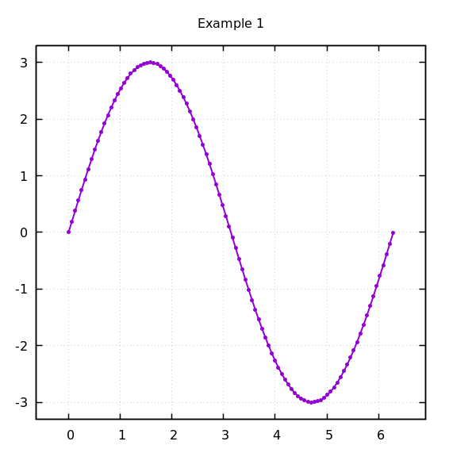

# gnuplotpy
Basic Python interface to Gnuplot.

Works under Python 2 and Python 3.

##  Installation
* pip: `pip install gnuplotpy`
* setuptools: `cd gnuplotpy && python setup.py install`
* Arch Linux: `yaourt -S python-gnuplotpy`

## Examples
### Passing Python variables to a Gnuplot script:

Gnuplot script:

	set datafile separator ','
	set term pngcairo size 20cm,20cm
	set out filename

	unset key
	set grid
	set border lw 1.5

	set title the_title
	set xrange [x_max-1.1*x_max:x_max*1.1]
	set yrange [-1.1*amp:1.1*amp]

	plot data u 1:2 w lp pt 7 ps 0.5 lw 2

	set out

Python Script:

	import numpy as np
	import gnuplotpy as gp

	amplitude = 3.
	x = np.linspace(0., 2*3.14, 100)
	y = amplitude*np.sin(x)

	args = {
	    'the_title': 'Example 1',
	    'amp': amplitude,
	    'x_max': x[-1],
	    'filename': 'example1.png'
	}
	data = [x, y]
	gp.gnuplot('test.gpi', args, data)
	
 

## Contributions
If you add functionality, I'd be interested and would
appreciate if you send me a pull request.
